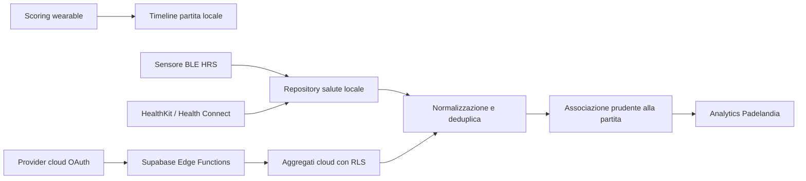

# Padelandia: audit e implementazione wearable salute unificata

Data verifica: 13 luglio 2026

## Esito

L'architettura ora separa esplicitamente quattro superfici che prima rischiavano
di essere confuse:

1. app wearable di scoring, come Apple Watch, Wear OS e Garmin Connect IQ;
2. hub salute di sistema, Apple HealthKit e Android Health Connect;
3. provider cloud post-sincronizzazione, Google Health e, in futuro, Oura e
   WHOOP diretti;
4. sensori live BLE conformi al profilo Heart Rate Service.

Oura Ring, WHOOP, Helio Strap, RingConn e Ultrahuman non vengono presentati
come dispositivi di scoring. Ogni provider ha capability, piattaforme,
limitazioni, stato tecnico e rollout centralizzati. Le integrazioni dirette
Oura e WHOOP sono implementate lato server ma restano disattivate finché non
sono disponibili approvazione, credenziali e test reali del provider.

## Architettura risultante



Contratto comune: `HealthDataProvider` espone connessione, stato,
autorizzazioni, metriche disponibili, sincronizzazione recente/intervallo,
metadati sorgente e cancellazione. Le capability impediscono alla UI di
promettere funzioni assenti.

## Matrice provider verificata

| Provider | Stato pubblico | Piano | Percorso reale | Limiti prima della produzione |
|---|---|---:|---|---|
| Apple Salute | PRODUCTION | Free | HealthKit locale, per tipo e sorgente | Apple non rivela se il permesso di lettura è stato negato per singolo tipo |
| Health Connect | PRODUCTION | Free | Store locale Android con Data Origin | Android 9+, Play Services; non supportato nei work profile |
| Fitbit / Pixel via Google Health | BETA | Premium | OAuth server-side, feed cloud e webhook | App Google Cloud, consenso OAuth e verifica/approvazione |
| Oura via hub salute | INDIRECT/BETA | Free | Apple Salute o Health Connect con attribuzione | Dipende dai tipi che Oura esporta e dai permessi scelti |
| Oura API diretta | INTERNAL/DISABLED | Premium | OAuth server-side, solo aggregati `daily` | App Oura approvata, credenziali e test revoca reali |
| WHOOP API diretta | INTERNAL/DISABLED | Premium | OAuth, webhook v2 firmati, aggregati | App WHOOP approvata, webhook e test account reali |
| Amazfit Helio Strap | INDIRECT/BETA, iOS | Free | Zepp verso Apple Salute | Nessun claim Android diretto finché non documentato e testato |
| Sensore cardiaco BLE | EXPERIMENTAL/INTERNAL | Free | HRS `0x180D`, notifiche `0x2A37` | Solo dispositivi standard; test fisico per ciascuna famiglia |
| RingConn | INDIRECT/BETA | Free | Health Connect o Apple Salute | RingConn non esporta attualmente HRV in Health Connect |
| Ultrahuman Ring | INDIRECT/BETA, iOS | Free | Apple Salute | Nessun percorso Android dichiarato stabile nel catalogo |
| Garmin Health API | RESEARCH | N/D | Non pubblicizzato; scoring Garmin resta Connect IQ | Approvazione, evaluation environment e licenza commerciale |
| Zepp OS diretto | RESEARCH | N/D | Non pubblicizzato come integrazione salute | Matrice modelli/API level e test hardware ancora necessari |
| Altri smart ring | NOT_SUPPORTED finché non verificati | N/D | Possibile solo tramite hub con sorgente riconoscibile | Nessun provider generico o dato inventato |

La matrice runtime vive in
`apps/rallymate/assets/config/health_provider_compatibility.json`; non esistono
liste duplicate sparse nelle schermate.

## Dati locali e offline-first

- Drift schema `10`: `health_data_sources`, `health_metric_records`,
  `health_source_preferences`, `match_health_summaries`, `health_sync_jobs` e
  `ble_sensor_devices`.
- Ogni record conserva provider, sorgente, intervallo temporale, unità,
  hash di contenuto, eventuale match e stato sync.
- L'identificativo OS/MAC del sensore BLE non viene persistito: resta soltanto
  durante la connessione; nel database viene salvato un fingerprint SHA-256.
- Il giorno corrente è `[mezzanotte locale, ora]`, non una finestra mobile di
  24 ore che ingloba la giornata precedente.
- Un match condiviso viene associato automaticamente solo con ID forte; una
  sovrapposizione temporale plausibile richiede conferma e un caso incerto non
  viene collegato.
- I dati partita e salute locali restano disponibili offline. La rete non è
  necessaria per scoring o registrazione BLE.

## Normalizzazione e deduplica

- Padelandia è sorgente preferita per i workout creati dall'app, così una copia
  riflessa da HealthKit/Health Connect non duplica la partita.
- Le preferenze per metrica sono esplicite e modificabili.
- Gli aggregati conservano Data Origin/source bundle e device metadata.
- HRV mantiene il metodo nell'unità: Apple Health usa `ms_sdnn`, Health
  Connect/Oura/WHOOP usano `ms_rmssd` dove disponibile. SDNN e RMSSD non sono
  mai fuse o confrontate come se fossero la stessa misura.
- Le importazioni cloud persistono riepiloghi bounded, non serie cardiache raw.
- La pipeline analytics generale può ora consumare questi record, ma tutte le
  dashboard non sono ancora migrate al nuovo repository: questa resta una
  fase successiva e non viene dichiarata come completata.

## Backend Supabase

Migrazioni principali:

- `20260713221737_unified_health_providers.sql`: catalogo rollout, sorgenti,
  metriche, preferenze, riepiloghi partita, job, webhook e cancellazione;
- `20260713233624_add_health_provider_retention.sql`: retention e cleanup;
- `20260713234622_harden_health_source_ownership.sql`: vincoli compositi
  sorgente/utente/provider;
- `20260713235041_harden_late_social_objects.sql`: revoca grant residui;
- `unified_health_provider_security_test.sql`: 22 controlli specifici inclusi
  nella suite pgTAP.

RLS limita lettura e scrittura al proprietario. Gli insert/update cloud sono
anche verificati come Premium; job, token e webhook sono accessibili solo al
`service_role`. Le foreign key composite impediscono a una scrittura server di
collegare sorgente, connessione o riepilogo appartenenti a utenti/provider
diversi.

I token OAuth sono cifrati AES-256-GCM con IV casuale e AAD
`userId|provider|kind`; la chiave resta nei secret Supabase. Il refresh usa un
lock atomico. State OAuth monouso e con scadenza protegge da CSRF/replay.

`health-provider` usa `verify_jwt=false` perché i callback OAuth non possono
portare un JWT Supabase; ogni POST dall'app autentica manualmente il bearer e
verifica Premium lato server. `health-provider-webhook` valida HMAC SHA-256
WHOOP sul timestamp più il body esatto, scarta replay oltre cinque minuti e
deduplica per `trace_id`.

Aggregati diretti, webhook e job conclusi hanno retention massima di 30 giorni.
Il cleanup gira alle 03:23 con `pg_cron`, oppure deve essere schedulato
esternamente se l'estensione non è disponibile. Token e connessioni restano
solo fino a revoca; disconnessione e cancellazione account rimuovono dati e
revocano i provider quando possibile.

## UI, onboarding e asset

`Profilo > Dispositivi e smartwatch > Salute e dispositivi` mostra soltanto
provider compatibili e abilitati. Ogni percorso dichiara connessione reale,
metriche, limiti, piano, passaggi guidati, stato, ultima sincronizzazione,
revoca e cancellazione dati.

Sono stati generati sei asset dedicati per Oura, WHOOP, Helio Strap, RingConn,
Ultrahuman e sensore BLE. Sono PNG RGBA 960x720, sotto 600 KB, con oltre il 75%
di trasparenza e fascia esterna completamente trasparente. Non contengono UI
inventata né fondali rettangolari; ereditano esattamente il colore della card.

Durante il QA è stato corretto anche un edge case di deep link: un link
ricevuto nel primo onboarding non resta più bloccato come duplicato per tutta
la sessione. La deduplica sopprime solo callback identici entro due secondi.

Evidenze visuali:

- `docs/evidence/health-provider-oura-ios.png`
- `docs/evidence/health-provider-oura-android.png`

## Sicurezza, privacy e costi

- Nessuna service-role, chiave DeepSeek, secret provider o token è presente nel
  client o nel repository sorgente.
- HealthKit e Health Connect restano locali; l'utente sceglie i tipi e può
  revocarli dalle impostazioni del sistema.
- Google Health e gli eventuali Oura/WHOOP diretti sono opt-in Premium e
  trasferiscono solo gli aggregati necessari.
- Non vengono importati dati clinici, SpO2 o GPS perché non necessari allo
  scopo attuale.
- Nessun dato salute è usato per advertising, tracking o decisioni mediche.
- Il percorso più economico e predefinito resta l'hub salute locale; i provider
  cloud sono limitati, rate-limited e soggetti a retention.

Privacy Policy italiana/inglese e Store Compliance sono state allineate al
funzionamento effettivo e specificano che Oura/WHOOP diretti sono disattivati.

## Confine Free e Premium

Free mantiene import locale Apple Salute/Health Connect, sorgenti indirette
verificate e sensore BLE quando il relativo rollout sperimentale è abilitato.
Non genera traffico verso API provider a pagamento e non carica automaticamente
dati salute nel cloud.

Premium abilita Google Health cloud e, solo dopo approvazione, Oura/WHOOP
diretti, sincronizzazione multi-device e insight cloud. Il controllo non è
soltanto visivo: Edge Function e RLS verificano piano, override test firmato o
ruolo amministrativo. Status, disconnessione e cancellazione restano
raggiungibili anche dopo downgrade, per non intrappolare dati o consenso.

## Verifiche completate

| Verifica | Risultato |
|---|---|
| `flutter analyze` | 0 problemi |
| `flutter test` | 85/85 passati |
| APK debug Android | compilato |
| iOS Simulator debug no-codesign | compilato |
| Edge Function `deno check` | passato |
| Test Deno | 15/15 passati |
| pgTAP Supabase | 110/110 passati, 6 file |
| `supabase db lint --level warning` | nessun errore/warning |
| Secret scan sorgenti | nessuna credenziale reale |
| QA visuale iPhone 17 Simulator | passato |
| QA visuale Android emulator | passato |

I test coprono anche: giorno civile, deduplica workout, SDNN/RMSSD,
fingerprint BLE, ownership RLS, policy Premium, OAuth state, revoca,
retention, HMAC/replay WHOOP e asset trasparenti.

## File principali creati o modificati

Client e dominio:

- `apps/rallymate/lib/domain/health_provider.dart`
- `apps/rallymate/lib/services/health_provider_catalog.dart`
- `apps/rallymate/lib/services/system_health_provider.dart`
- `apps/rallymate/lib/services/cloud_health_provider.dart`
- `apps/rallymate/lib/services/ble_heart_rate_provider.dart`
- `apps/rallymate/lib/services/health_deduplication.dart`
- `apps/rallymate/lib/services/match_health_association.dart`
- `apps/rallymate/lib/data/repositories/health_repository.dart`
- `apps/rallymate/lib/data/db/database.dart` e codice Drift generato
- `apps/rallymate/lib/features/devices/health_provider_setup_screen.dart`
- `apps/rallymate/lib/features/devices/devices_screen.dart`
- `apps/rallymate/lib/app.dart`
- `apps/rallymate/assets/config/health_provider_compatibility.json`

Bridge nativi:

- `apps/rallymate/android/app/src/main/kotlin/com/rallymate/rallymate/HealthConnectBridge.kt`
- `apps/rallymate/android/app/src/main/kotlin/com/rallymate/rallymate/BleHeartRateBridge.kt`
- `apps/rallymate/ios/Runner/HealthKitBridge.swift`
- `apps/rallymate/ios/Runner/BleHeartRateBridge.swift`

Backend:

- `backend/supabase/functions/health-provider/index.ts`
- `backend/supabase/functions/health-provider-webhook/index.ts`
- `backend/supabase/functions/_shared/health_cloud_provider.ts`
- `backend/supabase/functions/_shared/direct_health_sync.ts`
- `backend/supabase/functions/_shared/health_provider_policy.ts`
- migrazioni `20260713221737` fino a `20260713235041`
- `backend/supabase/tests/unified_health_provider_security_test.sql`

Test e documenti:

- test Flutter `health_provider_catalog`, `health_deduplication`,
  `health_connect`, `match_health_association` e `repository`
- test Deno per parser, policy, giorno civile e webhook
- `docs/SETUP.md`, policy privacy IT/EN e `docs/legal/STORE_COMPLIANCE.md`
- questo report e `docs/HEALTH_PROVIDER_ASSET_MANIFEST_2026-07-13.md`

## Fonti primarie verificate

- [Apple HealthKit](https://developer.apple.com/documentation/healthkit) e
  [autorizzazione HealthKit](https://developer.apple.com/documentation/healthkit/authorizing-access-to-health-data)
- [Android Health Connect](https://developer.android.com/health-and-fitness/health-connect),
  [disponibilità](https://developer.android.com/health-and-fitness/health-connect/availability) e
  [Data Origin](https://developer.android.com/health-and-fitness/health-connect/data-format)
- [Google Health API](https://developers.google.com/health) e
  [setup OAuth](https://developers.google.com/health/setup)
- [Oura OAuth](https://cloud.ouraring.com/docs/authentication)
- [WHOOP OAuth](https://developer.whoop.com/docs/developing/oauth/) e
  [webhook v2](https://developer.whoop.com/docs/developing/webhooks/)
- [Garmin Health API](https://developer.garmin.com/gc-developer-program/health-api/)
- [Zepp OS](https://docs.zepp.com/docs/guides/framework/device/intro/) e
  [permission model](https://docs.zepp.com/docs/v2/guides/framework/device/permission/)
- [Bluetooth SIG Heart Rate Service](https://www.bluetooth.com/specifications/specs/heart-rate-service-1-0/)
- [RingConn Health Connect](https://ringconn.com/blogs/news/ringconn-will-migrate-from-google-fit-to-health-connect)

## Deploy e secret

I comandi completi sono in `docs/SETUP.md`. Sequenza minima:

```bash
cd backend/supabase
supabase login
supabase link --project-ref <PROJECT_REF>
supabase db push
supabase functions deploy health-provider --no-verify-jwt
supabase functions deploy health-provider-webhook --no-verify-jwt
```

Sempre richiesto per i token cloud:

```bash
supabase secrets set WEARABLE_TOKEN_ENCRYPTION_KEY=<base64-di-32-byte-casuali>
```

Solo dopo approvazione Oura/WHOOP:

```text
OURA_CLIENT_ID
OURA_CLIENT_SECRET
OURA_REDIRECT_URI
WHOOP_CLIENT_ID
WHOOP_CLIENT_SECRET
WHOOP_REDIRECT_URI
WHOOP_WEBHOOK_SECRET
```

Non attivare `OURA_DIRECT` o `WHOOP_DIRECT` modificando solo un dart-define:
client e server devono entrambi restare `DISABLED` finché i test provider non
sono conclusi.

## Limiti e blocchi residui

1. Nessun test è stato eseguito con account Oura/WHOOP approvati; i rollout
   diretti devono restare disabilitati.
2. Nessun Helio Strap, smart ring o sensore BLE fisico è stato collegato in
   questa sessione. Prima di claim pubblici serve una matrice device reale.
3. HealthKit/Health Connect necessitano ancora di una prova permessi e revoca
   su iPhone e Android fisici, distinta dalla compilazione/simulazione.
4. Garmin Health richiede approvazione e licenza; Zepp OS richiede modulo
   dedicato e test per API level. Nessuno dei due viene pubblicizzato qui.
5. Google Health resta Beta e dipendente da console OAuth/approvazione.
6. La nuova base dati è pronta per analytics multi-provider, ma la migrazione
   di tutte le visualizzazioni analytics deve essere pianificata separatamente.

Con questi limiti dichiarati, la fondazione è production-ready per Apple
Salute e Health Connect locali; gli altri provider sono correttamente isolati
dietro stato, feature flag, entitlement e approvazione.
